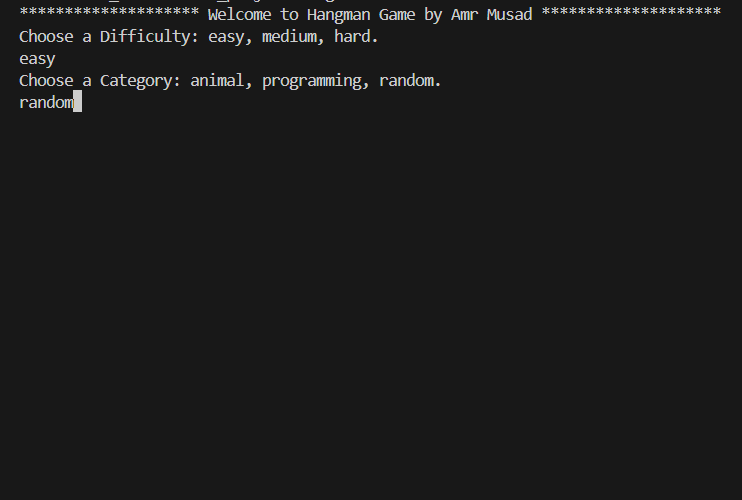
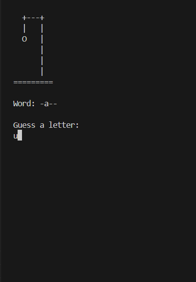
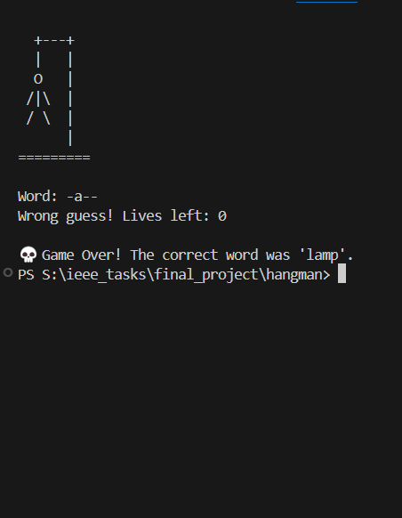

# 🎮 Hangman Game by Amr Musad

A fun terminal-based Hangman game written in Dart. Choose your difficulty and category, then guess letters to reveal the secret word before you run out of lives!

---

## 📸 Screenshots

  
  
  

---

## 🕹️ How to Play

1. **Choose a difficulty**: `easy`, `medium`, or `hard`.
2. **Choose a category**: `animal`, `programming`, or `random`.
3. The game will select a random word from the chosen difficulty and category.
4. You have **6 lives**. Guess letters one by one:
   - Correct guesses reveal the letters.
   - Wrong guesses cost a life and progress the hangman drawing.
5. Win by guessing the whole word before you run out of lives.

---

## 🧠 How It Works (Simplified)

- The game starts by asking for your difficulty and category.
- It picks a word randomly based on your choices using `Random`.
- It displays a blank version of the word and updates it with correct guesses.
- Lives decrease with each wrong guess, and the hangman ASCII art progresses.
- The game ends with either a win or loss message.

---